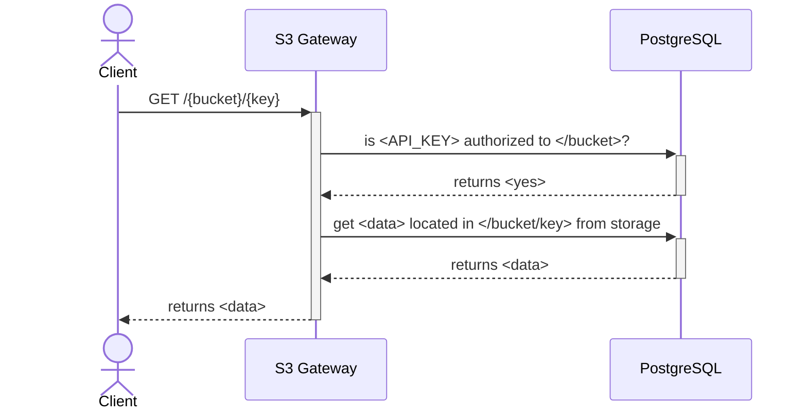
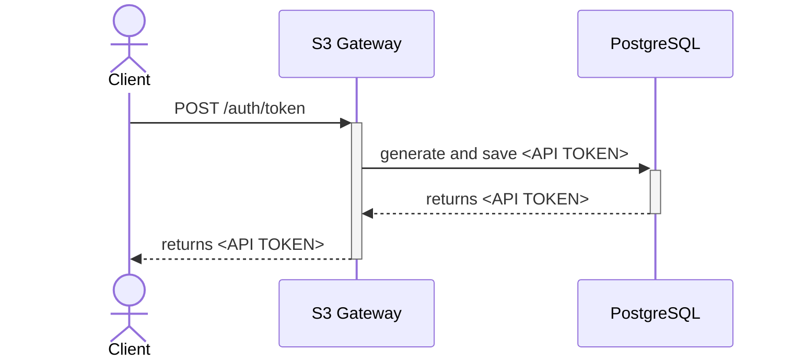

# S3 Gateway

## Getting data from storage

```mermaid
sequenceDiagram
    actor Client
    participant S3 Gateway
    participant PostgreSQL

    Client->>+S3 Gateway: GET /{bucket}/{key}
        S3 Gateway->>+PostgreSQL: is <API_KEY> authorized to </bucket>?
        PostgreSQL-->>-S3 Gateway: returns <yes>

        S3 Gateway->>+PostgreSQL: get <data> located in </bucket/key> from storage
        PostgreSQL-->>-S3 Gateway: returns <data>
    S3 Gateway-->>-Client: returns <data>
```

## Creating new API Key

```mermaid
sequenceDiagram
    actor Client
    participant S3 Gateway
    participant PostgreSQL

    Client->>+S3 Gateway: POST /auth/token
        S3 Gateway->>+PostgreSQL: generate and save <API TOKEN>
        PostgreSQL-->>-S3 Gateway: returns <API TOKEN>
    S3 Gateway-->>-Client: returns <API TOKEN>
```