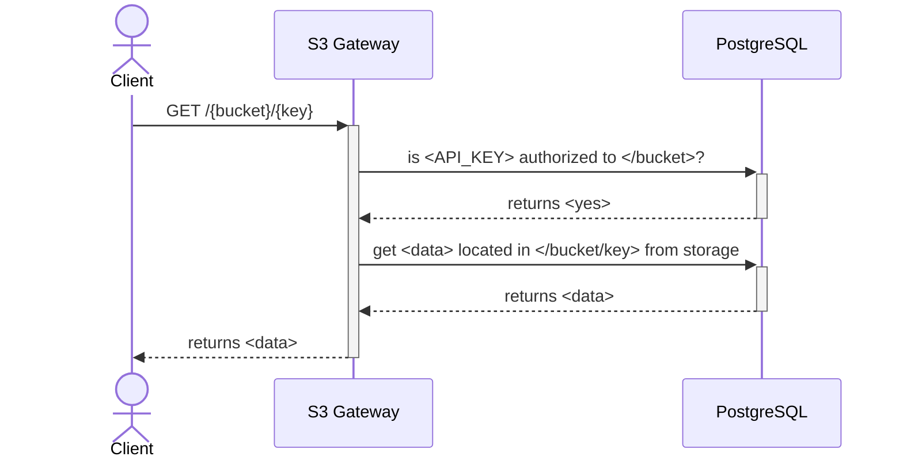
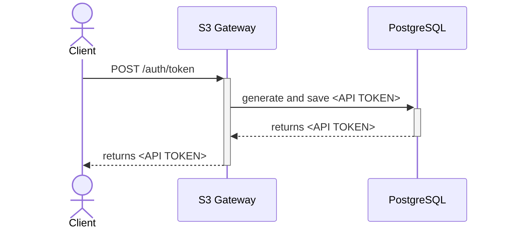
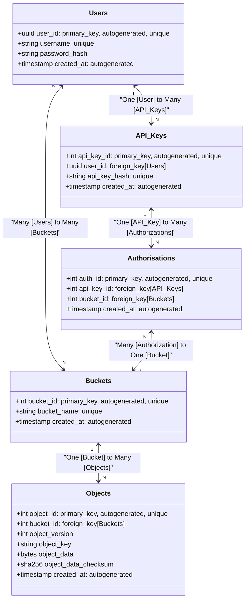

# S3 Gateway

The S3 Gateway is a service designed to interact with a storage system (likely an S3-compatible storage) and a PostgreSQL database. It facilitates operations such as retrieving data from storage and managing API keys for accessing the system.

## Flow

### Getting data from storage

This sequence diagram illustrates the process of a client requesting data from storage via the S3 Gateway. It involves the gateway checking if the provided API key is authorized to access the requested bucket, querying PostgreSQL for authorization, and retrieving the requested data from storage.

### Creating new API Key

This sequence diagram demonstrates the process of a client requesting to create a new API key via the S3 Gateway. It involves the gateway generating and saving a new API token in the PostgreSQL database and returning the generated token to the client.

## Data

### Relations

This class diagram represents the database schema of the project. It includes the following entities:

* **Users**: Represents users of the system with attributes such as `user_id`, `username`, `password_hash`, and `created_at`.
* **API_Keys**: Represents API keys associated with users, including attributes such as `api_key_id`, `user_id`, `api_key_hash`, and `created_at`.
* **Buckets**: Represents storage buckets with attributes such as `bucket_id`, `bucket_name`, and `created_at`.
* **Objects**: Represents objects stored within buckets with attributes such as `object_id`, `bucket_id`, `object_version`, `object_key`, `object_data`, `object_data_checksum`, and `created_at`.
* **Authorisations**: Represents authorizations for accessing buckets with attributes such as `auth_id`, `api_key_id`, `bucket_id`, and `created_at`.

The relationships between these entities are depicted as follows:

* Users can have multiple API keys (`One [User] to Many [API_Keys]`).
* Users can be associated with multiple buckets, and buckets can be associated with multiple users (`Many [Users] to Many [Buckets]`).
* Each bucket can contain multiple objects (`One [Bucket] to Many [Objects]`).
* Each API key can have multiple authorizations (`One [API_Key] to Many [Authorizations]`).
* Many authorizations can be associated with one bucket (`Many [Authorizations] to One [Bucket]`).

